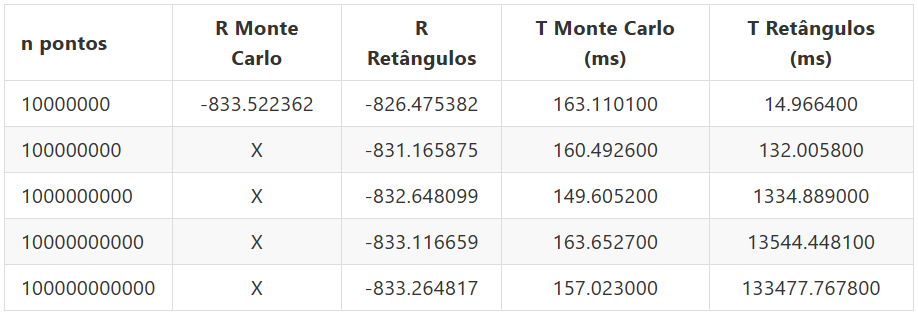

### Atividade 05

Desenvolvida por:

-   Izalorran Bonaldi (GRR20210582);
-   Yuri Junqueira Tobias (GRR20211767);

Data de entrega: 22/11/2023
Docente: Guilherme Alex Derenievicz

Especificades:

-   A saída do tempo em milisegundos segue o padrão indicado pela biblioteca utils.h;
-   Conclusões a respeito da comparação dos resultados para n = 2 dimensões entre os métodos dos Retângulos e Monte Carlo:
    Inicialmente é válido apresentar os dados para uma entrada de exemplo antes mesmo de fazer os comentários a respeito da
    convergência dos métodos e dos resultados obtidos:
    
    Como é possível observar, o resultado obtido com o método de Monte Carlo é sempre o mesmo uma vez que não são feitas altera-
    ções no número de pontos que devem ser utilizados. Por outro lado, para o método dos retângulos o número de pontos varia de
    10^7 até 10^11, sendo que utilizando este último a gente chega em um valor próximo, considerando "delta < 0.3", do obtido pelo
    método de Monte Carlo para 10^7 pontos somente ao adotar 10^11 pontos, sendo que delta = | Resultado obtido com o método de
    Monte Carlo | - | Resultado obtido com o método dos Retângulos |, nesse caso, para 10^10, delta = 0,405703 e para 10^11, delta
    = 0,257545, conforme a tabela apresentada acima. Outro fato interessante e ainda mais importante é que em termos de tempo, o
    método de Monte Carlo acaba sendo consideravelmente melhor, em especial se levarmos em consideração o fato de que quando o valor calculado pelo método dos Retângulos se aproxima do valor ideal ou até do valor calculado pelo método de Monte Carlo o tempo
    gasto pelo mesmo (método dos Retângulos), é expressivamente maior.
    Obs: os parâmetros utilizados na entrada foram: a: -5, b: 5, n: 10000000 (esse é o valor base, mas para o método dos Retângulos
    o mesmo varia).
-   Conclusões a respeito da comparação dos resultados para n = 2, 4 e 8, exclusivamente, no método de Monte Carlo:
    A respeito do resultado em si não é possível concluir muita coisa além do fato de que os valores são consideravelmente diferentes.
    Entretanto, no que diz respeito ao tempo gasto para o cálculo é possível dizer que o tempo praticamente dobra conforme se aumenta
    o número de pontos, ou seja, para n = 4 o tempo dobrou, se comparado a n = 2, e para n = 8 o tempo ficou aproximadamente 4x maior
    se comparado a n = 2.
-   As principais otimizações feitas giram em torno de tentar minimizar ao máximo o número de operações de ponto flutuante, para isso
    em diversos momentos são utilizadas variáveis locais para armazenar cálculos, em especial multiplicações, que serão utilizadas de
    forma recorrente.
